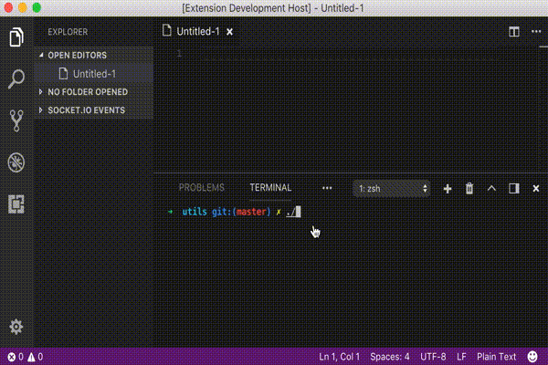

# Socket.io client for VSCode
Extension to communicate with Socket.io 2 server from VSCode.

---

This extension allows to establish connection to Socket.io server, emit events and receive events from server.

## Usage

## Featured

1. [ ] Implement view of event data
2. [ ] Add availability to connect to multiple servers
3. [ ] Add functionality to emit events with data from file
4. [x] Integrate with CI and code quality services
5. [ ] Add tests
